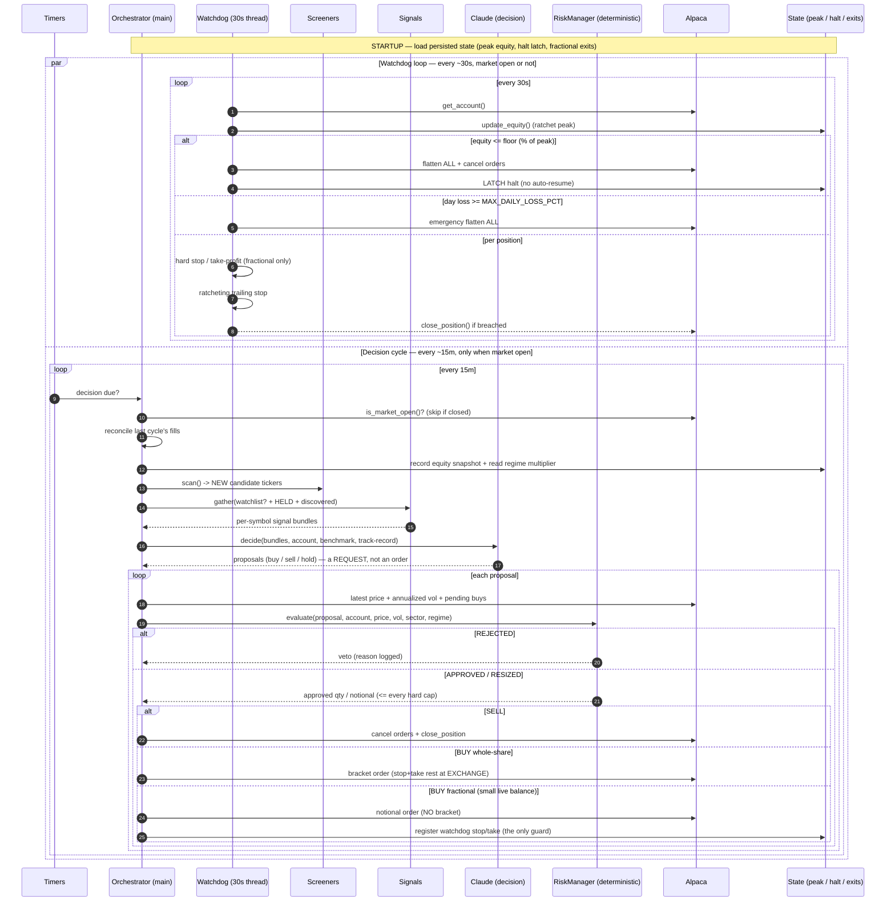

# Model flow & timelines

Two independent loops run concurrently from one process (`orchestrator.run`):

| Loop | Cadence | Thread | Gated by kill switch / market-open? | Job |
|------|---------|--------|-------------------------------------|-----|
| **Decision cycle** | `DECISION_INTERVAL_SECONDS` (default **900s = 15m**; production runs **3600s = 60m** per the 2026-07 API-cost decision) | main | YES — only runs when market is open; new buys gated by kill switch | Discover → judge → size → place / thesis-exit |
| **Watchdog** | `MONITOR_INTERVAL_SECONDS` (default **30s**) | daemon | NO — closing is *never* gated | Hard stop / take-profit / trailing / emergency flatten / equity floor |

The watchdog is the fast safety net; the decision cycle is the slow brain. The
watchdog can sell at any time even while the decision thread is blocked on the LLM.

## How a HELD position is decided keep-vs-sell (note 3)

A bought position is re-judged on **two clocks at once**:

1. **Every 30s (watchdog, price-driven, deterministic):** hard stop, take-profit,
   ratcheting trailing stop, account-wide daily-loss flatten, and the latched
   equity floor. This is what caps loss intraday — no LLM, no waiting.
2. **Every ~15m (decision cycle, thesis-driven, market open only):** every held
   symbol is re-fed through the full signal stack to Claude alongside fresh
   candidates, and Claude can return `sell` if the thesis broke. That sell still
   passes through RiskManager (always allowed — risk reduction) before it executes.

So "is this still good to keep?" is answered continuously by price (30s) and every
15 minutes by thesis. **Gap today (Phase 1B.4):** there is no max-hold age and no
explicit stale-thesis exit — a name that quietly stops working but never hits a
price stop and that Claude never flags is held indefinitely. That deterministic
time-stop / thesis-decay exit is the next item to add.
